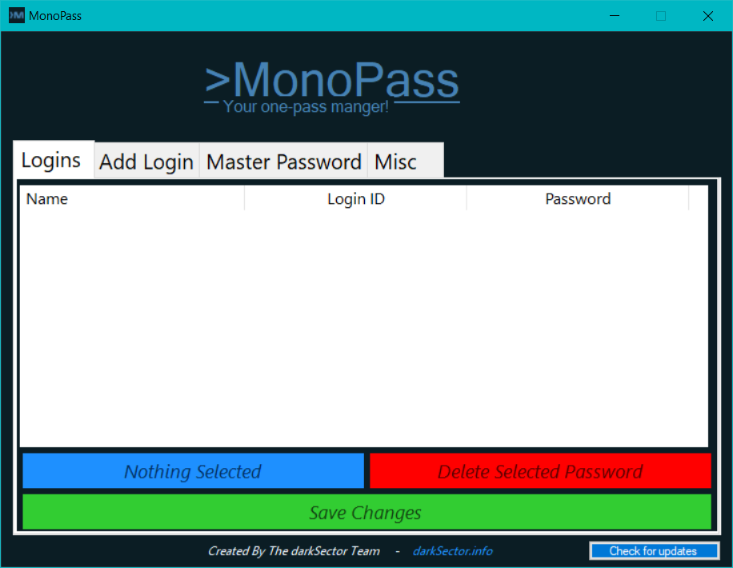
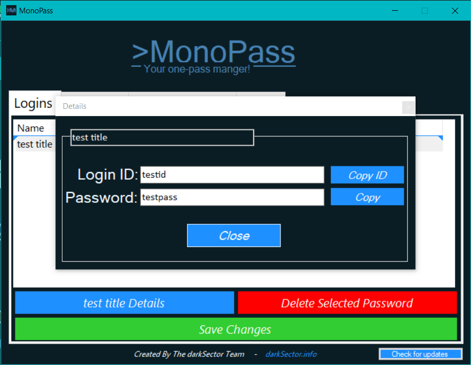
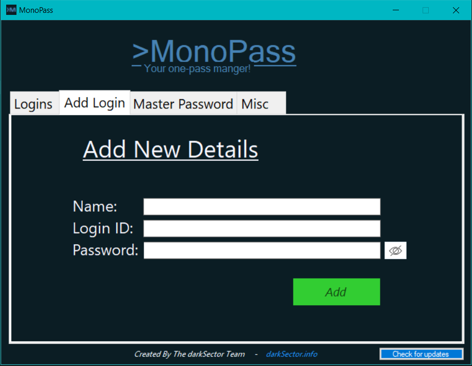
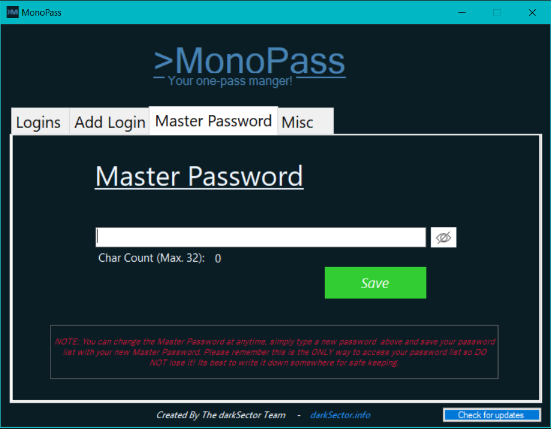
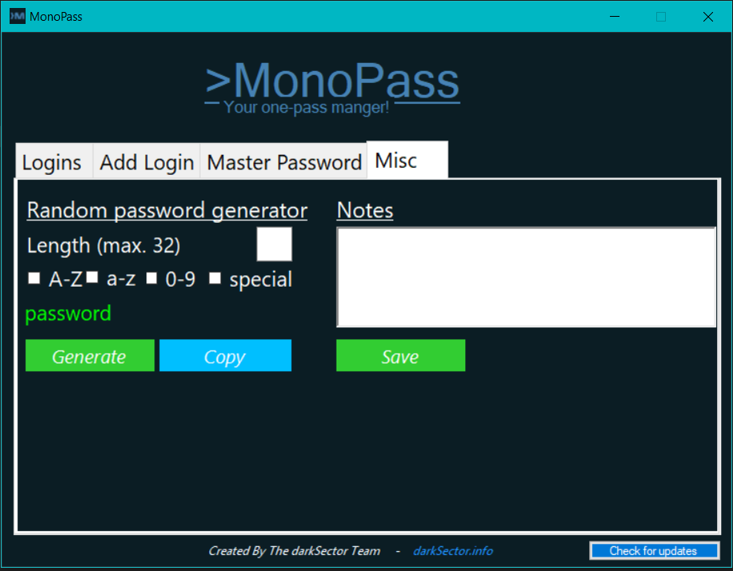

# MonoPass v0.3 Stable
## created by The darkSector Team

#### Released: 09/06/2021 
### <i>Last Update: 07/08/2021</i>

#### Description: 
MonoPass is pretty much exactly what it sounds like. Its an open source one-stop-catch-all password manager. It has handy features such as making Backups(In the cloud or external...), database encryption, and Random password generator! You can also customize its look with different Theme styles (To be implemented... :D). 
  
There will also be many more features and add-ons to come, this is only a Beta build! I also would like to hear feedback from you guys on things you would like to see happen in future builds, dont be afraid to comment!!
  
There is a ToDo List you can also check for some ideas :smile:
  
Created by The darkSector Team.

Updates:  
V0.2 
-creates data dir if doesnt exist 
-fixed form2.cs ui padding 
-fixed error when closing form1.cs by X button 
-added random password generator & notes 
-added update check 

V0.3 
-made credential name editable
-"copied..." label timer bug fixed
-update check repaired

I hope you enjoy this release! If you want to see more releases like this, check out our Discord server at: 
https://discord.gg/DcxPygc
  
Thanks for viewing!
  
### NOTE: The font is messed up not sure why, there must have been a custom font package I used back when I create this project, but now seem to have lost. :( Just change the font to your liking, otherwise it will updated in a future build :D
